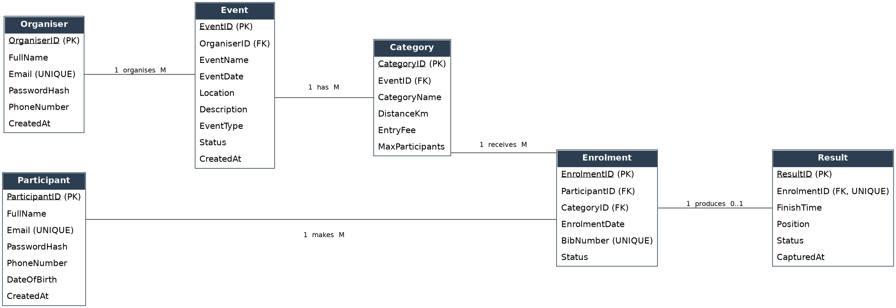

# RaceDay System

## Part 1 – System Planning, Database Design, API Planning and CI/CD

---

## 1. Project Description

RaceDay is a full-stack web-based event management system designed for the South African running, walking and cycling community.

The purpose of the system is to provide a central platform where Event Organisers can create and manage sporting events, while Participants can browse events, select categories, enrol for events and view their race results.

The system is designed around two main user roles:

- Organiser
- Participant

The database was designed to support the main activities of the RaceDay system while maintaining data integrity through primary keys, foreign keys, unique constraints, default values and check constraints.

---

## 2. System Objectives

The main objectives of the RaceDay system are to:

1. Allow Organisers to create and manage sporting events.
2. Allow Organisers to create categories for their events.
3. Allow Participants to browse available events.
4. Allow Participants to enrol in event categories.
5. Store participant enrolment information.
6. Store race results after an event has taken place.
7. Prevent invalid and duplicate database records.
8. Provide a structured database that can be accessed through a RESTful API.
9. Use GitHub for version control.
10. Use GitHub Actions to automatically validate the required Part 1 files.

---

## 3. User Roles

### 3.1 Organiser

An Organiser is responsible for creating and managing events.

The Organiser can:

- Create events
- Edit events
- Delete events
- Create event categories
- Update event categories
- Delete event categories
- View participant enrolments
- Capture participant results
- View results for events

The Organiser is linked to events through the `OrganiserID` foreign key in the `Event` table.

---

### 3.2 Participant

A Participant is a person who takes part in RaceDay events.

The Participant can:

- Create an account
- View upcoming events
- View event information
- View available categories
- Enrol in an event category
- View their enrolments
- View their race results

Participants are connected to events through the `Enrolment` table.

---

# 4. Technology Stack

| Component | Technology |
|---|---|
| Database | Microsoft SQL Server |
| Database Tool | SQL Server Management Studio (SSMS) |
| Database Language | T-SQL |
| Version Control | GitHub |
| CI/CD | GitHub Actions |
| ERD Tool | Mermaid Live Editor |
| Documentation | Microsoft Word / Markdown |

---

# 5. Database Design

The RaceDay database is called:

`RaceDayDB`

The database contains six core entities:

| Entity | Purpose |
|---|---|
| Organiser | Stores event organiser information |
| Participant | Stores participant information |
| Event | Stores RaceDay events |
| Category | Stores categories available for events |
| Enrolment | Stores participant entries into categories |
| Result | Stores participant race results |

The database follows the relationships identified in the ERD and is designed so that related information is stored separately instead of duplicating the same information across multiple tables.

---

# 6. Entity Relationship Diagram (ERD)

The ERD represents the structure of the RaceDay database and shows how the entities are connected.



### Main Relationships

| Relationship | Cardinality | Explanation |
|---|---|---|
| Organiser → Event | 1 : Many | One Organiser can manage many Events |
| Event → Category | 1 : Many | One Event can contain many Categories |
| Participant → Enrolment | 1 : Many | One Participant can have many Enrolments |
| Category → Enrolment | 1 : Many | One Category can contain many Enrolments |
| Enrolment → Result | 1 : 0..1 | An Enrolment can have zero or one Result |

### ERD Design Decisions

The `Event` table contains `OrganiserID` because every event must be associated with an organiser.

The `Category` table contains `EventID` because categories belong to a specific event.

The `Enrolment` table contains both `ParticipantID` and `CategoryID`. This connects participants to the categories they have entered and resolves the many-to-many relationship between Participants and Categories.

The `Result` table contains `EnrolmentID`. A result is associated with a specific enrolment.

The relationship between `Enrolment` and `Result` is optional because a participant can enrol before the race has taken place. Therefore, an enrolment does not necessarily have a result immediately.

---

# 7. Database Tables

## 7.1 Organiser

The `Organiser` table stores information about users who manage RaceDay events.

Important fields include:

- `OrganiserID` – Primary key
- `FullName` – Organiser's name
- `Email` – Unique email address
- `PasswordHash` – Stores the password hash
- `PhoneNumber` – Optional contact number
- `CreatedAt` – Date and time the organiser was created

---

## 7.2 Participant

The `Participant` table stores information about people who participate in RaceDay events.

Important fields include:

- `ParticipantID` – Primary key
- `FullName` – Participant's name
- `Email` – Unique email address
- `PasswordHash` – Stores the password hash
- `PhoneNumber` – Optional contact number
- `DateOfBirth` – Participant's date of birth
- `CreatedAt` – Date and time the participant was created

---

## 7.3 Event

The `Event` table stores the main information about each RaceDay event.

Important fields include:

- `EventID` – Primary key
- `OrganiserID` – Foreign key to Organiser
- `EventName` – Name of the event
- `EventDate` – Date and time of the event
- `Location` – Event location
- `Description` – Event description
- `EventType` – Running, Cycling or Walking
- `Status` – Scheduled, Cancelled or Completed
- `CreatedAt` – Date and time the event was created

---

## 7.4 Category

The `Category` table stores the different participation categories available for each event.

Important fields include:

- `CategoryID` – Primary key
- `EventID` – Foreign key to Event
- `CategoryName` – Name of the category
- `DistanceKm` – Distance of the category
- `EntryFee` – Cost of entering the category
- `MaxParticipants` – Maximum number of participants

---

## 7.5 Enrolment

The `Enrolment` table records when a participant enters an event category.

Important fields include:

- `EnrolmentID` – Primary key
- `ParticipantID` – Foreign key to Participant
- `CategoryID` – Foreign key to Category
- `EnrolmentDate` – Date of enrolment
- `BibNumber` – Unique race number
- `Status` – Pending, Confirmed or Cancelled

The combination of `ParticipantID` and `CategoryID` is unique so that the same participant cannot enrol in the same category more than once.

---

## 7.6 Result

The `Result` table stores race performance information.

Important fields include:

- `ResultID` – Primary key
- `EnrolmentID` – Foreign key to Enrolment
- `FinishTime` – Participant finish time
- `Position` – Final race position
- `Status` – Finished, DNF or DSQ
- `CapturedAt` – Date and time the result was captured

Each enrolment can have a maximum of one result.

---

# 8. Database Integrity and Constraints

Database constraints were included to ensure that incorrect or duplicate information cannot easily be inserted.

## Primary Keys

Every table has a primary key that uniquely identifies each record.

Examples:

```text
OrganiserID
ParticipantID
EventID
CategoryID
EnrolmentID
ResultID
