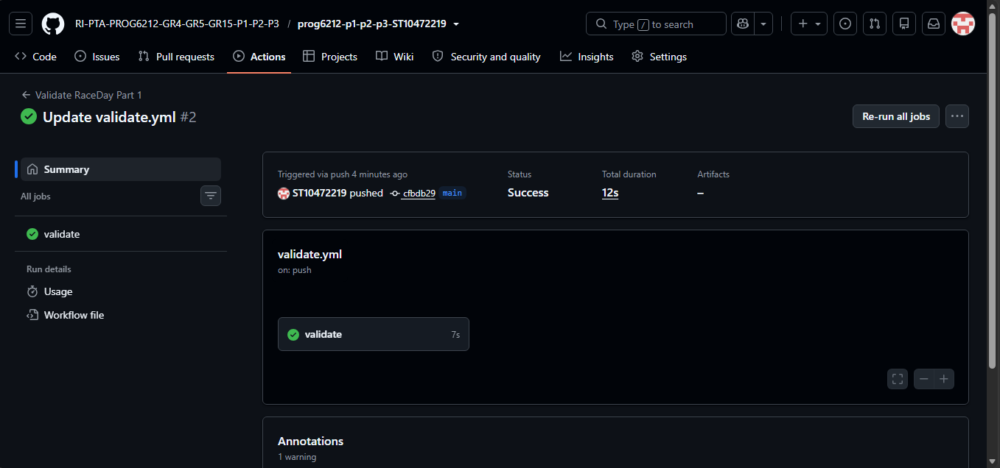

# RaceDay

## Project Description

RaceDay is a full-stack web-based event management system designed for the South African road running, walking, and cycling community.

The system allows Event Organisers to create and manage events, categories and participant results. Participants can browse upcoming events, enter events, view their enrolments and track their personal results.

## User Roles

### Organiser

The Organiser can:

- Create, edit and delete events
- Manage event categories
- View event enrolments
- Capture participant results

### Participant

The Participant can:

- Create an account
- Browse upcoming events
- Enter events by selecting a category
- View their enrolments
- Track their personal results

## Part 1 - System Planning and Database

Part 1 contains the planning and database components of the RaceDay system.

The `docs` folder contains:

- RaceDay ERD
- API Endpoint Plan
- SQL Database Script

The database contains six entities:

- Organiser
- Participant
- Event
- Category
- Enrolment
- Result

The SQL script creates the database, tables, primary keys, foreign keys, constraints and sample data.

## Database Constraints

The database uses primary keys, foreign keys, NOT NULL constraints, UNIQUE constraints, DEFAULT values and CHECK constraints to maintain data integrity.

## System Relationships

The RaceDay system uses the following main relationships:

- One Organiser can organise many Events.
- One Event can have many Categories.
- One Participant can have many Enrolments.
- One Category can have many Enrolments.
- One Enrolment can have zero or one Result.

These relationships are represented in the RaceDay ERD and implemented using primary and foreign keys in the SQL database.

## GitHub Actions / CI

GitHub Actions is used to validate the required Part 1 repository structure.

The workflow checks that the `docs` folder exists and contains the required ERD, API Endpoint Plan and SQL database script.

### Successful CI Build

## Database

The RaceDay database is implemented using Microsoft SQL Server.

The database schema includes relationships between organisers, events, categories, participants, enrolments and results. Sample data is included in the SQL script for testing purposes.
